# HC-CDSS: Healthcare Clinical Decision Support System

> **Note:** All patient names, diagnoses, medications, and clinical data in this repository are entirely fictitious and were created solely for system testing and demonstration. No real patient data is used or represented anywhere in this project.

---

## Overview

HC-CDSS ingests a patient FHIR ID, fans out across 5 specialized AI agents via Google Cloud Pub/Sub, and synthesizes a clinical decision support summary, including differential diagnoses, matched clinical protocols, drug/allergy alerts, and immediate action recommendations, with every step pseudonymized through Cloud DLP and persisted to Firestore and BigQuery with a complete audit trail.

---

## System Architecture

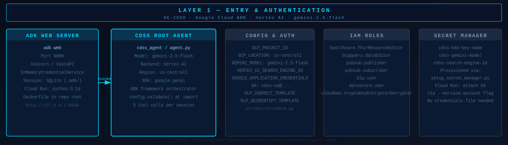

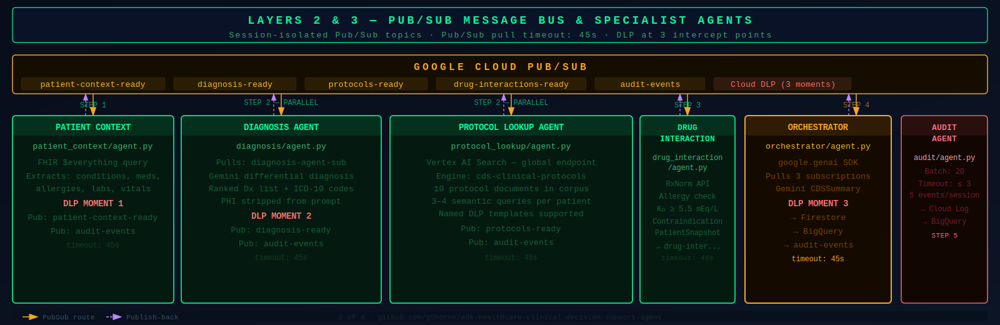

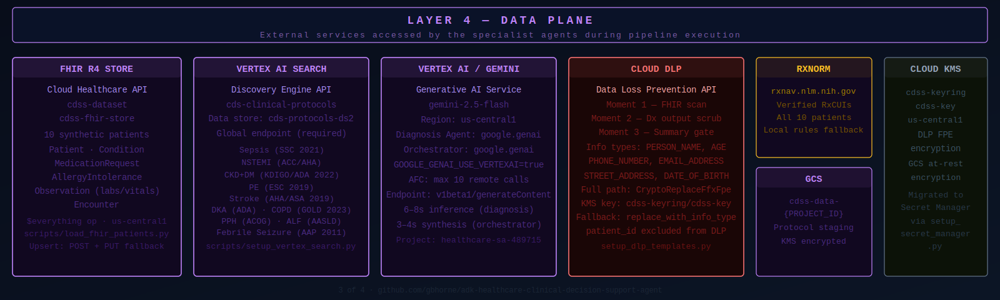

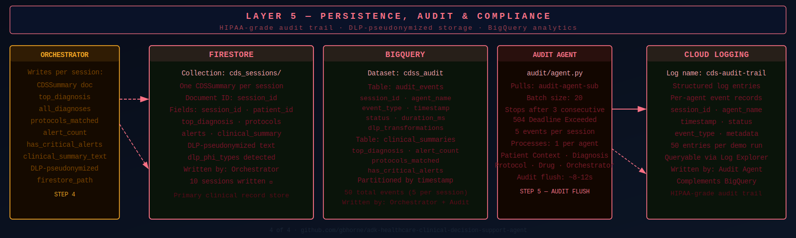

The system is organized into five layers. Layer 1 (Entry) handles the ADK Web Server, CDSS Root Agent, service account auth, and config. Layer 2 (Pub/Sub Bus) provides 5 topics coordinating all inter-agent messaging. Layer 3 (Specialist Agents) runs Patient Context, Diagnosis, Protocol Lookup, Drug Interaction, and Orchestrator agents. Layer 4 (Data Plane) covers FHIR R4, Vertex AI Search, Gemini 2.5 Flash, Cloud DLP, RxNorm, and GCS. Layer 5 (Persistence and Audit) handles Firestore, BigQuery, Cloud Logging, KMS, and the Audit Agent.

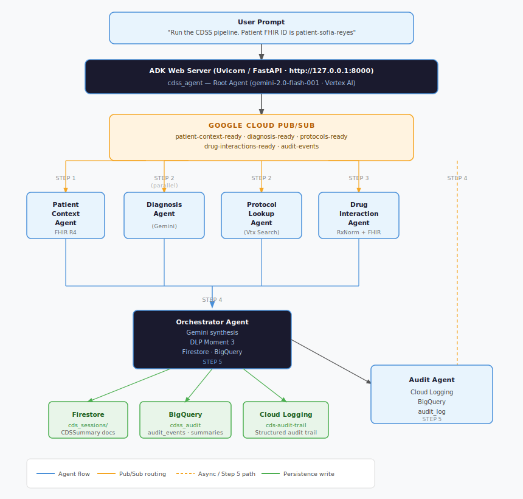

---

## GCP Services Used

| Service | Purpose | Resource Name |
|---|---|---|
| Google ADK | Multi-agent orchestration framework | cdss_agent |
| Gemini 2.5 Flash | Differential diagnosis + clinical synthesis | gemini-2.5-flash |
| Vertex AI | LLM API backend | us-central1-aiplatform.googleapis.com |
| Cloud Healthcare API (FHIR R4) | Patient record storage and retrieval | cdss-dataset / cdss-fhir-store |
| Vertex AI Search | Clinical protocol retrieval (RAG) | cds-clinical-protocols / cds-protocols-ds2 |
| Cloud Pub/Sub | Async agent-to-agent messaging | 5 topics · 8 subscriptions |
| Cloud DLP | PHI detection and pseudonymization | 3 pipeline intercept points |
| Cloud Firestore | CDSSummary document storage | cds_sessions/ |
| BigQuery | Session analytics and audit log | cdss_audit.audit_events + clinical_summaries |
| Cloud Logging | Real-time structured audit trail | cds-audit-trail |
| Cloud Storage | Protocol document staging | cdss-data-{PROJECT_ID} |
| Cloud KMS | DLP encryption keyset | cdss-keyring / cdss-key |

---

## Data Privacy: Cloud DLP

PHI protection is implemented at three pipeline intercept points:

| Moment | Agent | Trigger | PHI Types Detected |
|---|---|---|---|
| Moment 1 | Patient Context Agent | Post-FHIR fetch, pre-publish | PERSON_NAME, DATE, ADDRESS |
| Moment 2 | Diagnosis Agent | Post-Gemini output, pre-publish | PERSON_NAME, MEDICAL_RECORD_NUMBER |
| Moment 3 | Orchestrator Agent | Pre-Firestore/BQ write | PERSON_NAME, AGE |

---

## Synthetic Patient Cohort

**10 fictitious patients** spanning emergency medicine, cardiology, obstetrics, pediatrics, nephrology, neurology, pulmonology, and hepatology, all loaded to the FHIR store and validated end-to-end:

| # | Patient | Scenario | Top Diagnosis |
|---|---|---|---|
| 1 | Diane Okafor, 67F | CKD + AKI + drug alerts | AKI on CKD |
| 2 | James Tran, 34M | Septic shock, urosepsis | Septic Shock / Pyelonephritis |
| 3 | Marcus Webb, 58M | NSTEMI workup | Acute NSTEMI |
| 4 | Sofia Reyes, 42F | Post-flight dyspnea, leg swelling | Acute Pulmonary Embolism |
| 5 | David Conrad, 62M | Left-sided weakness, aphasia | Acute Ischemic Stroke |
| 6 | Amara Osei, 19F | BG 580 mg/dL, Kussmaul breathing | Diabetic Ketoacidosis (DKA) |
| 7 | Robert Chen, 71M | COPD exacerbation, purulent cough | Acute COPD w/ Pneumonia |
| 8 | Charlotte Blandy, 28F | Postpartum hemorrhage, EBL 1800mL | Uterine Atony (PPH) |
| 9 | Peter J Rolle, 6M | Febrile seizure, 39.8°C | Febrile Seizure, Simple |
| 10 | Linda Marsh, 49F | Acetaminophen 6g/day x 10d, jaundice | Acetaminophen-induced ALF |

50 total audit events written to BigQuery and Cloud Logging (5 per session). All sessions live in Firestore `cds_sessions/`.

---

## Pipeline Run Screenshots

All 10 patients were run through the complete pipeline on March 9, 2026. Screenshots captured from the ADK Dev UI at `http://127.0.0.1:8000`.

---

### Patient 1: Diane Okafor · AKI on Chronic Kidney Disease

ADK trace showing the 5-step pipeline execution. 2 drug/allergy alerts generated (non-critical). 1 protocol matched (CKD/Diabetes). DLP PERSON_NAME transformation applied.

| ADK Trace | Final Summary |
|---|---|
| 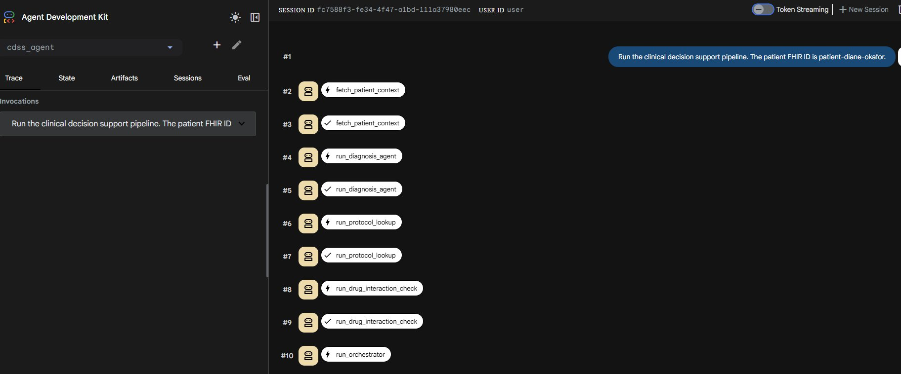 |  |

<details>
<summary>Re-run (post audit-fix): confirming clean 5-event audit flush</summary>

| Re-run Trace | Re-run Summary |
|---|---|
| 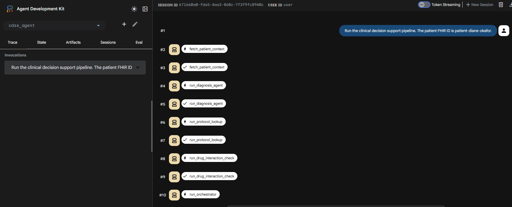 | 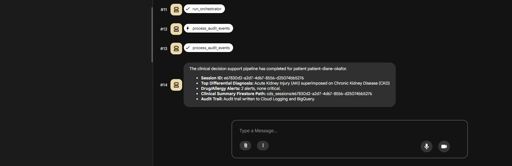 |

</details>

---

### Patient 4: Sofia Reyes · Acute Pulmonary Embolism

Parallel Step 2 clearly visible (run_diagnosis_agent + run_protocol_lookup firing simultaneously). 0 protocols found; PE not yet in search corpus. DLP PERSON_NAME transformation applied.

| ADK Trace | Final Summary |
|---|---|
| 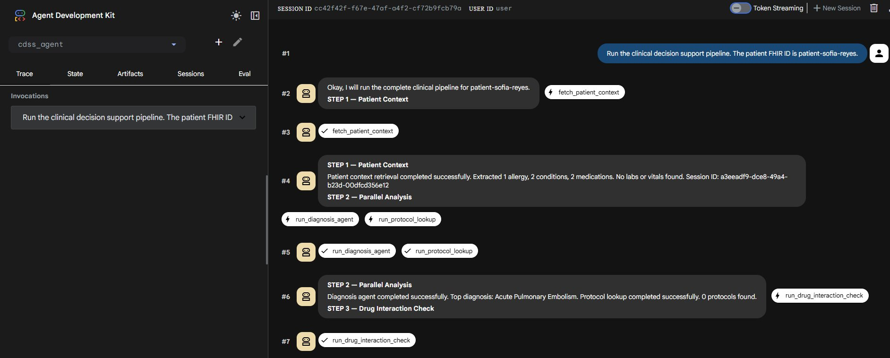 | 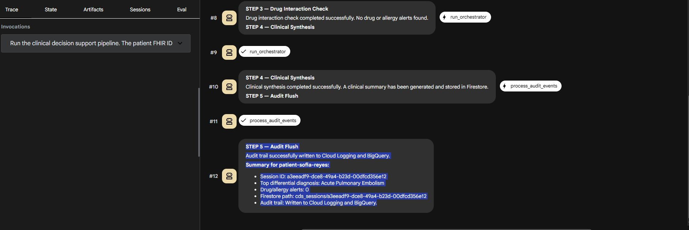 |

---

### Patient 5: David Conrad · Acute Ischemic Stroke

Full verbose trace with STEP 1-5 labels annotated in ADK output. Protocol matched. DLP PERSON_NAME transformation applied. Session URL visible in browser tab.

| ADK Trace (steps 1-4) | Session URL | Summary |
|---|---|---|
| 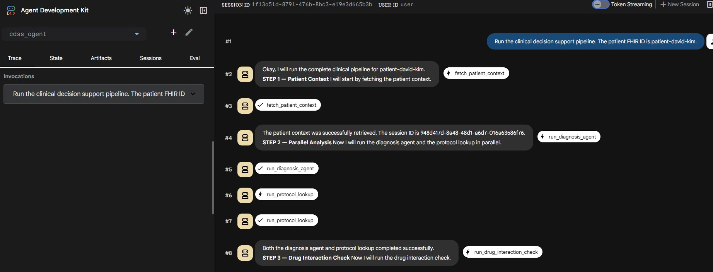 | 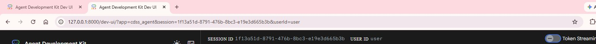 | 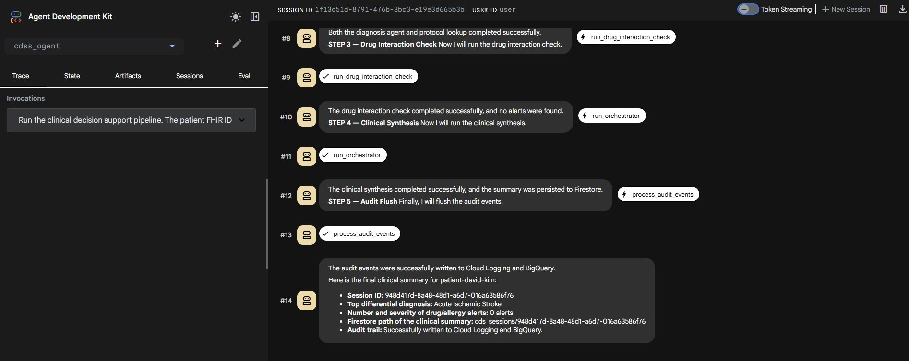 |

---

### Patient 6: Amara Osei · Diabetic Ketoacidosis

DKA matched via CKD/Diabetes protocol document. 0 drug alerts. Clean 5-event audit flush.

| ADK Trace | Final Summary |
|---|---|
| 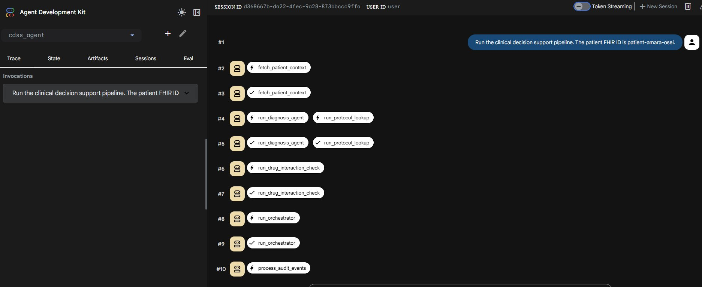 |  |

---

### Patient 7: Robert Chen · Acute COPD Exacerbation with Pneumonia

COPD + Pneumonia presentation. Protocol matched. Parallel Step 2 visible. 0 alerts.

| ADK Trace | Final Summary |
|---|---|
| 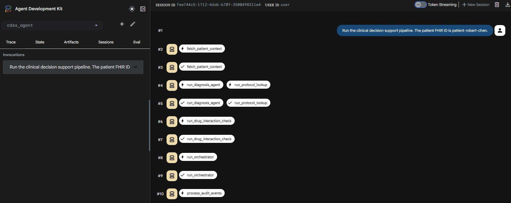 |  |

---

### Patient 8: Charlotte Blandy · Uterine Atony (PPH)

Postpartum hemorrhage case. Verbose STEP labels in ADK output. DLP 0 transformations. 0 drug alerts. DLP 0 transformations (no PHI in generated summary text).

| ADK Trace | Final Summary |
|---|---|
| 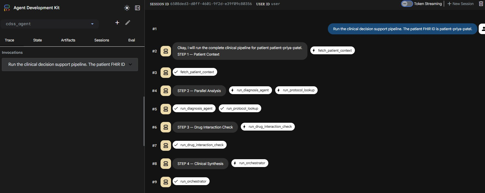 |  |

---

### Patient 9: Peter J Rolle · Febrile Seizure, Simple

Pediatric patient (6 years old). DLP `AGE` type detected, correctly flagged as PHI in pediatric context. 0 protocols matched. 0 drug alerts.

| ADK Trace | Final Summary |
|---|---|
| 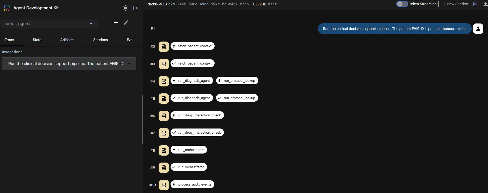 |  |

---

### Patient 10: Linda Marsh · Acetaminophen-induced Acute Liver Failure

Full 12-step ADK trace with invocation timing panel visible. CKD protocol matched via ALF ICD overlap. DLP PERSON_NAME transformation applied.

| ADK Trace | Final Summary |
|---|---|
| 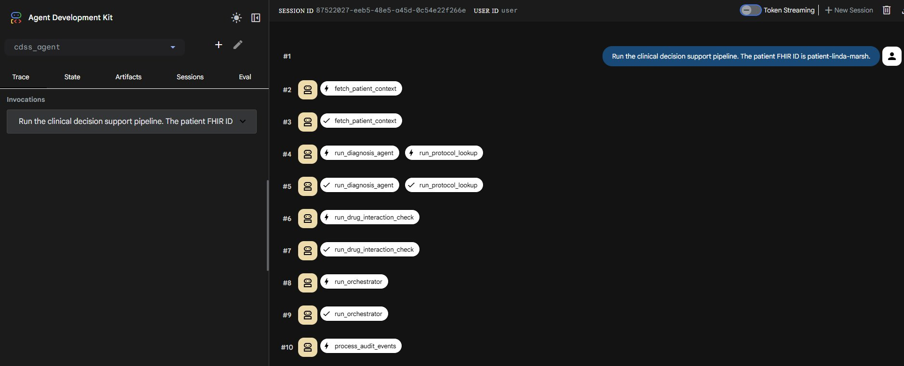 | 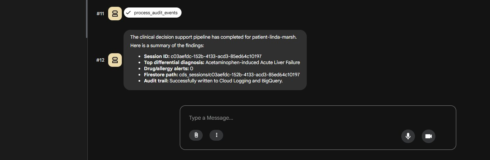 |

---

## Project Structure

```
hc-cdss/
├── cdss_agent/
│   └── agent.py                  # ADK root agent, entry point and pipeline coordinator
├── agents/
│   ├── patient_context/
│   │   └── agent.py              # FHIR $everything + DLP Moment 1
│   ├── diagnosis/
│   │   └── agent.py              # Gemini differential diagnosis + DLP Moment 2
│   ├── protocol_lookup/
│   │   └── agent.py              # Vertex AI Search clinical protocol retrieval
│   ├── drug_interaction/
│   │   └── agent.py              # FHIR + RxNorm + local rules drug/allergy check
│   ├── orchestrator/
│   │   └── agent.py              # Gemini synthesis + DLP Moment 3 + persistence
│   └── audit/
│       └── agent.py              # Cloud Logging + BigQuery audit flush
├── shared/
│   ├── config.py                 # GCP resource IDs and Pub/Sub subscription names
│   ├── models.py                 # Pydantic models (PatientContextMessage, CDSSummary, etc.)
│   └── pubsub_client.py          # Pub/Sub publish/pull helpers
├── data/
│   └── synthetic/                # 10 synthetic FHIR patient bundles (R4 JSON)
├── docs/
│   └── assets/
│       ├── diagram-1-entry.svg         # Layer 1 — Entry and Auth
│       ├── diagram-2-agents.svg         # Layers 2+3 — PubSub and Specialist Agents
│       ├── diagram-3-data.svg           # Layer 4 — Data Plane
│       ├── diagram-4-persistence.svg    # Layer 5 — Persistence and Audit
│       ├── hc-cdss-architecture.svg     # Legacy full-system diagram (reference)
│       ├── hc-cdss-pipeline.svg         # Pipeline execution overview
│       └── screenshots/               # ADK Dev UI pipeline run evidence (all 10 patients)
├── requirements.txt
├── .env.example
└── README.md
```

---

## Setup

### Prerequisites

- Python 3.11+
- Google Cloud project with billing enabled
- `gcloud` CLI authenticated (`gcloud auth application-default login`)
- Google ADK: `pip install google-adk`

### Enable GCP APIs

```bash
gcloud services enable \
  healthcare.googleapis.com \
  pubsub.googleapis.com \
  dlp.googleapis.com \
  firestore.googleapis.com \
  bigquery.googleapis.com \
  storage.googleapis.com \
  aiplatform.googleapis.com \
  discoveryengine.googleapis.com \
  cloudkms.googleapis.com \
  --project=YOUR_PROJECT_ID
```

### Environment Variables

```bash
cp .env.example .env
```

```env
GCP_PROJECT_ID=your-project-id
GCP_LOCATION=us-central1
GCS_BUCKET=cdss-data-your-project-id
KMS_KEY_NAME=projects/your-project-id/locations/us-central1/keyRings/cdss-keyring/cryptoKeys/cdss-key
FHIR_DATASET_ID=cdss-dataset
FHIR_STORE_ID=cdss-fhir-store
FHIR_LOCATION=us-central1
BQ_DATASET=cdss_audit
BQ_AUDIT_TABLE=audit_events
BQ_SESSIONS_TABLE=clinical_summaries
GOOGLE_APPLICATION_CREDENTIALS=sa-key.json
GEMINI_MODEL=gemini-2.5-flash
VERTEX_AI_SEARCH_ENGINE_ID=cds-clinical-protocols
```

### Install and Run

```bash
pip install -r requirements.txt

# PowerShell
$env:GOOGLE_GENAI_USE_VERTEXAI = "true"
$env:GOOGLE_CLOUD_PROJECT = "your-project-id"
$env:GOOGLE_CLOUD_LOCATION = "us-central1"
$env:GOOGLE_APPLICATION_CREDENTIALS = "$PWD\sa-key.json"

adk web
```

Navigate to `http://127.0.0.1:8000` and send:

```
Run the clinical decision support pipeline. The patient FHIR ID is patient-marcus-webb.
```

### Load Synthetic Patients to FHIR Store

```bash
for f in data/synthetic/patient-*.json; do
  curl -X POST \
    "https://healthcare.googleapis.com/v1/projects/$GCP_PROJECT_ID/locations/$FHIR_LOCATION/datasets/$FHIR_DATASET_ID/fhirStores/$FHIR_STORE_ID/fhir/Bundle" \
    -H "Authorization: Bearer $(gcloud auth print-access-token)" \
    -H "Content-Type: application/fhir+json" \
    -d @"$f"
done
```

---

## Key Technical Decisions

**Why Pub/Sub between every agent?**
Decoupling, replay, and observability. Each agent can be independently restarted or scaled without touching others. If the Orchestrator crashes mid-run, it can re-pull its Pub/Sub messages without any upstream agent re-executing.

**Why the `global` endpoint for Vertex AI Search?**
The regional endpoint (`us-central1`) returned 404 for all queries in this configuration. The `global` endpoint resolved correctly. When in doubt, always use `global` with Discovery Engine.

**Why `consecutive_timeouts` in the audit agent?**
Pub/Sub returns 504 on empty queues rather than an empty response. Without a termination condition, the audit agent would poll indefinitely. Three consecutive timeouts reliably indicates the queue is drained.

**Why pin `gemini-2.5-flash` instead of an unversioned alias?**
Unversioned model aliases can silently shift when Google updates them. Pinning the exact version prevents unexpected behavioral changes in production.

---

## Known Limitations and Pending Improvements

| Item | Status | Notes |
|---|---|---|
| RxNorm 404s | **Complete** | All 10 synthetic patient FHIR bundles written with verified NLM RxCUI codes. Load via `scripts/load_fhir_patients.py`. |
| Named DLP templates | **Complete** | `scripts/setup_dlp_templates.py` creates named inspect/deidentify templates. All 3 agents use templates when `DLP_INSPECT_TEMPLATE` / `DLP_DEIDENTIFY_TEMPLATE` are set in `.env`; inline config remains as fallback for local dev. |
| Secret Manager | **Complete** | `scripts/setup_secret_manager.py` migrates KMS key name, model, and search engine ID to Secret Manager. For Cloud Run, attach service account via `--service-account` and remove `GOOGLE_APPLICATION_CREDENTIALS` entirely. |
| Protocol corpus | **Complete** | 10 protocol documents — Sepsis (SSC 2021), NSTEMI (ACC/AHA 2022), CKD+DM (KDIGO/ADA 2022), PE (ESC 2019), Stroke (AHA/ASA 2019), DKA (ADA), COPD (GOLD 2023), PPH (ACOG 2017), Febrile Seizure (AAP 2011), ALF (AASLD 2011). Load via `scripts/setup_vertex_search.py`. |
| Cloud Run deployment | **Complete** | `Dockerfile` included. Deploy with `gcloud run deploy`. See Dockerfile header for full command. Estimated provisioning time: 15-20 minutes. |
| Clinical demo UI | Planned | A clinical-facing UI layer on top of Firestore/BigQuery output is planned. |

---

## License

MIT

---

> **Disclaimer:** All patient names, FHIR data, diagnoses, medications, session IDs, and clinical information in this repository are entirely fictitious. This is a technical demonstration prototype. It is not a medical device and provides no clinical advice.

---

## Author

**Gregory B. Horne**
Cloud Solutions Architect

[GitHub: gbhorne](https://github.com/gbhorne) | [LinkedIn](https://linkedin.com/in/gbhorne)
